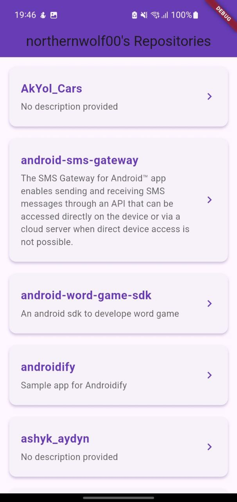

# github_repo
# 🌐 GitHub Repositories App — Flutter + BLoC

A **beautiful Flutter application** that demonstrates:  
✅ **GitHub OAuth authentication**  
✅ **Listing the authenticated user's repositories** using the **GitHub REST API**  
💡 Built with **BLoC** state management for a clean and scalable architecture.


## 📷 Screenshots

<p align="center">
  
  &nbsp;&nbsp;
  
</p>


---

## ✨ Features

### 🛠 Screen 1 — Authentication
- 🔑 Sign in with **GitHub** (OAuth 2.0 Authorization Code Flow with PKCE).
- 👤 Display authenticated user's **profile** (avatar + username).

### 📂 Screen 2 — Repositories
- 📜 Fetch repositories from the **GitHub API** (`/user/repos`).
- ℹ️ Show name, description, visibility, star count ⭐, and language.
- 🔄 Pull-to-refresh support.
- 📥 Pagination for loading more repositories.

---

## 🧰 Technologies Used
- **Flutter** (latest stable)
- **BLoC** → [`flutter_bloc`](https://pub.dev/packages/flutter_bloc)
- **HTTP Client** → [`http`](https://pub.dev/packages/http)
- **OAuth Flow** → [`flutter_web_auth_2`](https://pub.dev/packages/flutter_web_auth_2) or [`oauth2_client`](https://pub.dev/packages/oauth2_client)
- **Secure Storage** → [`flutter_secure_storage`](https://pub.dev/packages/flutter_secure_storage)

---

## 📁 Project Structure
```plaintext
lib/
├─ main.dart
├─ app.dart
├─ bloc/
│  ├─ auth/
│  │  ├─ auth_bloc.dart
│  │  ├─ auth_event.dart
│  │  ├─ auth_state.dart
│  └─ repos/
│     ├─ repos_bloc.dart
│     ├─ repos_event.dart
│     ├─ repos_state.dart
├─ repositories/
│  └─ github_repository.dart
├─ services/
│  ├─ oauth_service.dart
│  └─ storage_service.dart
├─ screens/
│  ├─ auth_screen.dart
│  └─ repos_screen.dart
├─ models/
└─ utils/

⚙️ Setup Guide
1️⃣ Create a GitHub OAuth App

    Go to GitHub → Settings → Developer settings → OAuth Apps.

    Click New OAuth App.

    Set:

        Homepage URL: https://yourapp.com (can be placeholder)

        Authorization callback URL: myapp://callback

    Save Client ID.
    Use PKCE or a backend server to exchange the code for a token (do not store secrets in app).

2️⃣ Configure the App

Edit your oauth_service.dart:

const clientId = "YOUR_CLIENT_ID";
const redirectUri = "myapp://callback";
const scopes = ["read:user", "repo"];

🔗 GitHub API Endpoints Used

    Get Authenticated User → GET https://api.github.com/user

    List User Repositories → GET https://api.github.com/user/repos

        Query params: page, per_page, sort
